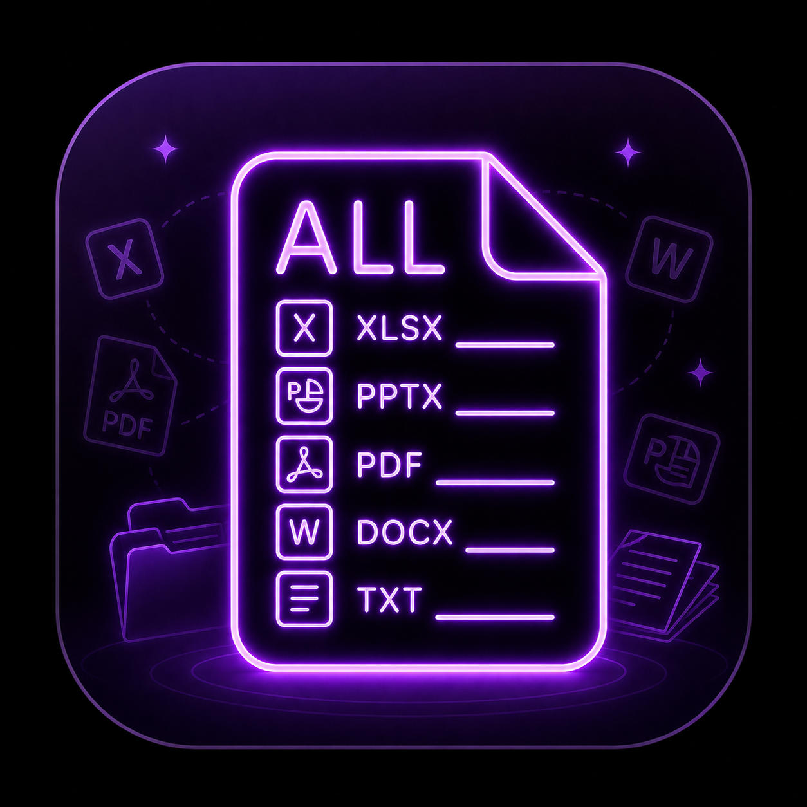
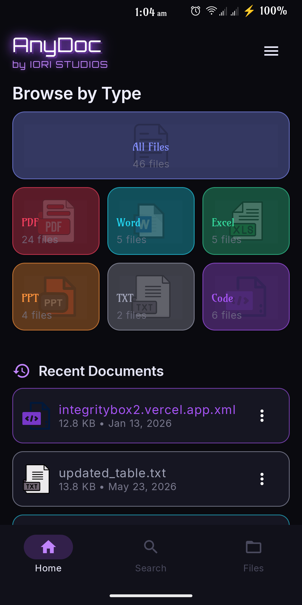
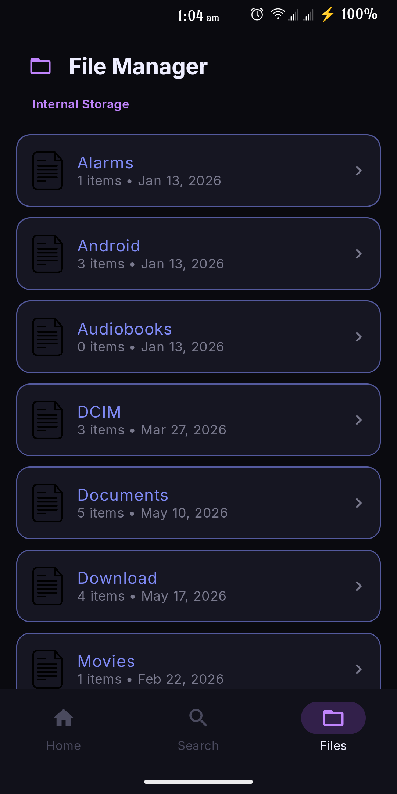
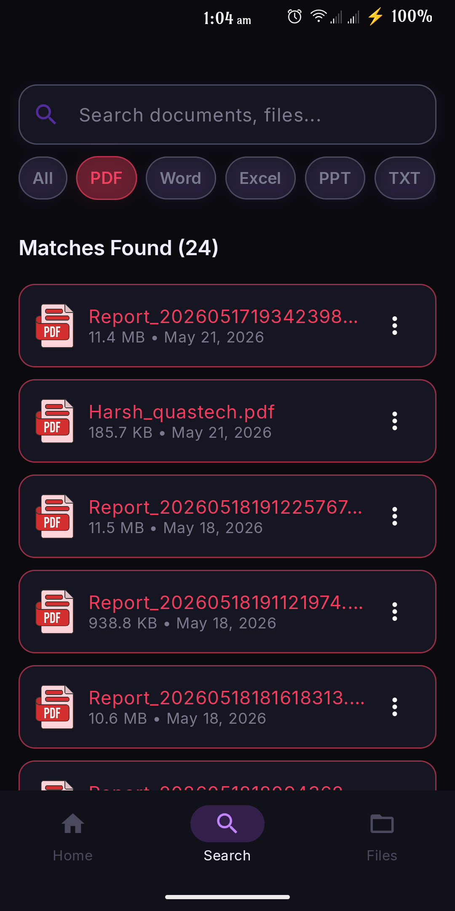
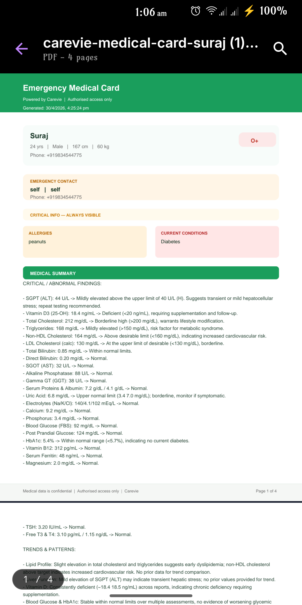
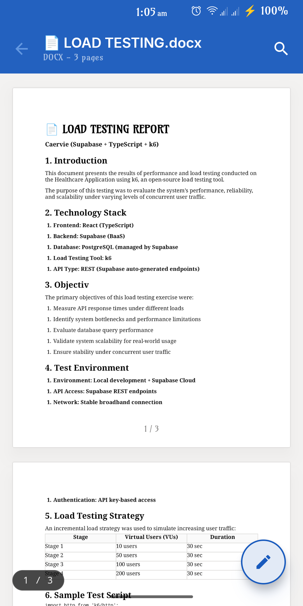
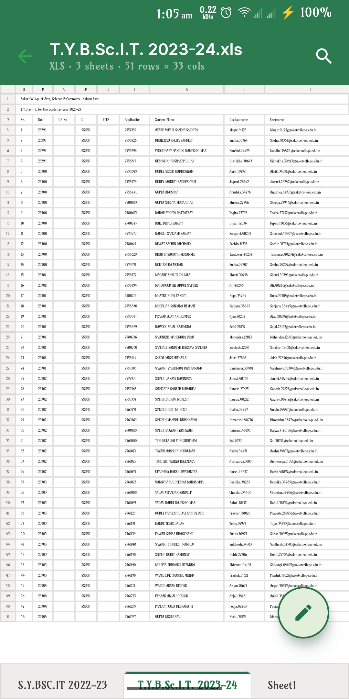
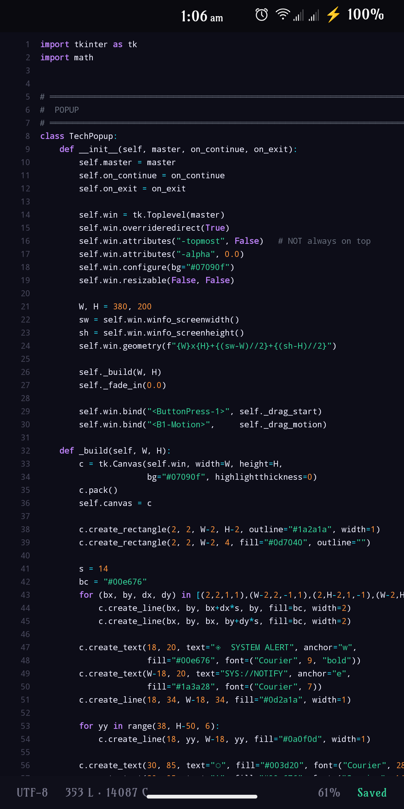

<p align="center">
  
</p>

<h1 align="center">AnyDoc - Universal Document Viewer & Editor</h1>

<p align="center">
  <strong>A lightning-fast, ad-free, and open-source document viewer for Android.</strong>
</p>

---

## 📖 Motivation

I built **AnyDoc** out of frustration with existing document viewers that are bloated, slow, or riddled with intrusive ads. I wanted a clean, simple, and ad-free way to open files. As a result, I learned the basics of Android development, Kotlin, and Jetpack Compose to build this app. AnyDoc is designed to respect your privacy and your time.

---

## ✨ Features

- **Ad-Free Experience:** No ads, no trackers, no interruptions. Just you and your documents.
- **Universal Format Support:** Open Office documents, PDFs, spreadsheets, presentations, markdown, and source code files all in one app.
- **Lightning Fast Native UI:** Built entirely with modern Jetpack Compose for buttery smooth rendering and navigation.
- **Edit Capabilities:** Not just a viewer! AnyDoc supports editing for text, markdown, CSV, DOCX, and XLSX files directly from your device.
- **Advanced Document Searching:** Quickly find documents by searching and toggling the filters such as PDFs, Word documents, and text files.
- **Recent Files & File Browser:** A built-in robust file manager to explore local storage and quickly access recently opened documents.
- **Secure & Private:** Works completely offline. Your documents never leave your device.

---

## 📂 Supported Formats

AnyDoc intelligently detects and handles a wide variety of file formats using robust rendering engines:

| Category | Supported Formats | Mode |
| :--- | :--- | :--- |
| **PDF Documents** | `.pdf` | Read-only |
| **Word & Rich Text** | `.docx`, `.doc`, `.rtf` | Read (`.doc`, `.rtf`) / Edit (`.docx`) |
| **Spreadsheets** | `.xlsx`, `.xls`, `.csv` | Edit (`.xlsx`, `.xls`, `.csv`) |
| **Presentations** | `.pptx`, `.ppt` | Read-only |
| **Markdown** | `.md` | Read / Edit (Native Rendering) |
| **Text & Code** | `.txt`, `.xml`, `.kt`, `.java`, `.py`, `.json`, `.js`, `.cpp`, `.html`, etc. | Edit (Syntax Highlighting) |

---

## 📸 Screenshots

<div align="center">
  <table>
    <tr>
      <td align="center"><br><b>Home Screen</b><br>Quick access to recent files</td>
      <td align="center"><br><b>File Browser</b><br>Navigate local storage</td>
      <td align="center"><br><b>Search</b><br>Super-Fast Document search</td>
      <td align="center"><br><b>PDF Viewer</b><br>Fast native PDF rendering</td>
    </tr>
  </table>
  <table>
    <tr>
      <td align="center"><br><b>Word Viewer</b><br>Read and edit DOCX files</td>
      <td align="center"><br><b>Spreadsheet Viewer</b><br>View & edit XLSX/CSV</td>
      <td align="center"><br><b>Code Editor</b><br>Edit source code and text</td>
    </tr>
  </table>
</div>

---

## 🛠 Tech Stack & Libraries

AnyDoc is built using a modern Android tech stack, adhering to MVVM architecture and the latest Jetpack libraries.

### Core Architecture
- **Language:** Kotlin (1.9.24)
- **UI Toolkit:** Jetpack Compose (Material 3)
- **Architecture:** MVVM (Model-View-ViewModel)
- **Navigation:** Navigation Compose
- **Data Persistence:** DataStore (Preferences)

### Document Parsing & Rendering
- **Apache Tika:** Robust file type and MIME type detection.
- **Apache POI (`poi`, `poi-ooxml`, `poi-scratchpad`):** Industry-standard libraries for parsing and extracting data from legacy (`.doc`, `.ppt`, `.xls`) and modern (`.docx`, `.pptx`, `.xlsx`) Microsoft Office formats.
- **Apache XMLBeans:** XML schema support required by POI OOXML.
- **Android PdfRenderer & PdfBox-Android:** Native OS-level rendering for PDFs and robust text extraction for PDF search functionalities.
- **Markwon:** Native, offline Markdown rendering without relying on bulky WebViews.
- **AndroidAWT:** AWT compatibility stubs to allow Apache POI to function seamlessly on the Android JVM.

---

## 🚀 Getting Started

### Prerequisites
- Android Studio Iguana (or newer)
- Android SDK 34
- JDK 17

### Building from Source
1. Clone the repository:
   ```bash
   git clone https://github.com/h-iori/AnyDoc.git
   ```
2. Open the project in **Android Studio**.
3. Sync the project with Gradle files.
4. Run the `app` configuration on an emulator or a physical device running Android 10 (API 29) or higher.

*(Note: If you are building a release APK, you will need to set up your `keystore.properties` file in the root directory.)*

---

## 📜 License
This project is open-source and free to use.

---
*Built with ❤️ to keep your documents ad-free.*
